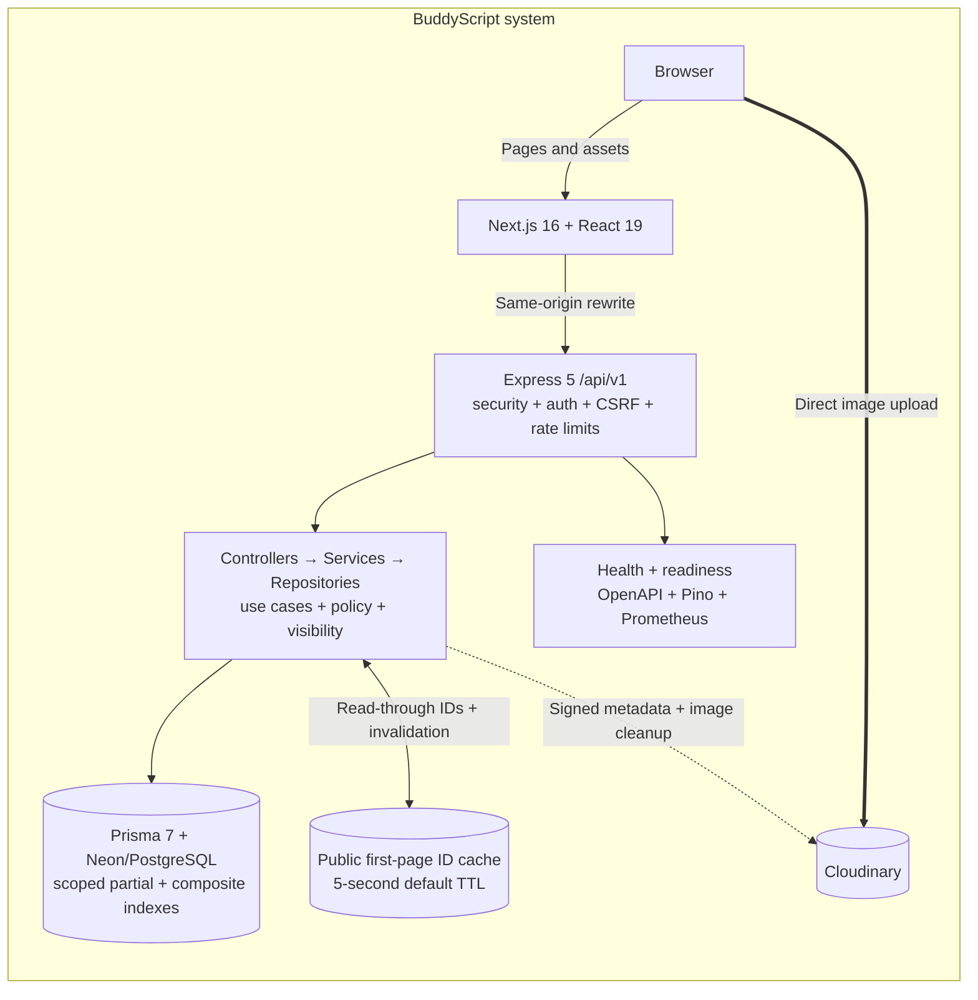
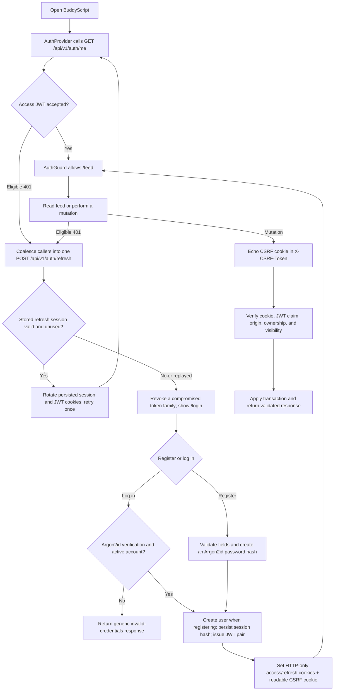
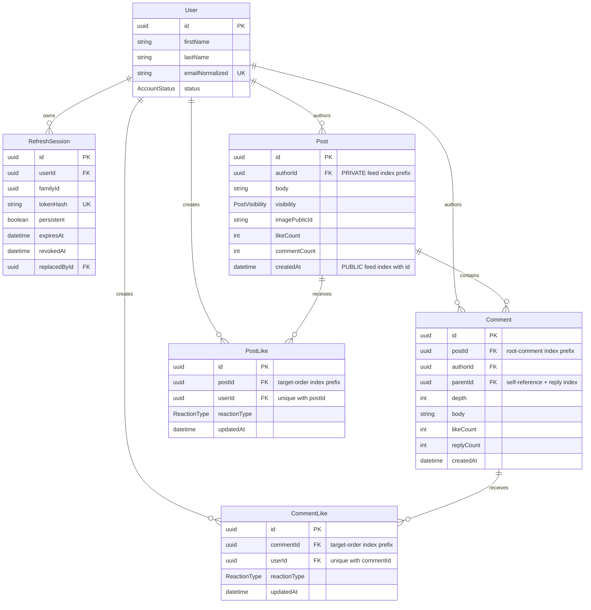

# BuddyScript — Technical Overview and Design Decisions

BuddyScript is a full-stack implementation of a small scope replication of a social media platform. We converted the supplied Login, Register, and Feed designs into a responsive Next.js application backed by a secure Express API and PostgreSQL. This document is the short technical companion to the setup-focused READMEs: it explains what is functional, how the main pieces relate, and why we made the important engineering choices.

## Submission snapshot

| Deliverable       | Link or status                                                                                                     |
| ----------------- | ------------------------------------------------------------------------------------------------------------------ |
| Source code       | [GitHub repository](https://github.com/MrMandalNSU/buddy-script)                                                   |
| Live application  | [buddy-script-sudipta.vercel.app](https://buddy-script-sudipta.vercel.app)                                         |
| Video walkthrough | [buddy-script-video-walkthrough](https://youtu.be/a6HbxaTAtkA)                                                     |
| Detailed setup    | [Full-stack README](./README.md), [frontend guide](./frontend/README.md), and [backend guide](./backend/README.md) |

## What we built

BuddyScript combines the supplied visual design with a typed, production-oriented web stack:

| Layer                        | Technologies                                                                    | How we use them                                                                                                      |
| ---------------------------- | ------------------------------------------------------------------------------- | -------------------------------------------------------------------------------------------------------------------- |
| Frontend                     | Next.js 16, React 19, TypeScript, App Router                                    | Implements `/login`, `/register`, and the protected `/feed` experience.                                              |
| UI and assets                | Responsive CSS, local Poppins fonts, supplied images and SVGs                   | Preserves the reference design while supporting desktop and mobile layouts.                                          |
| Client state and validation  | TanStack Query, Zod, React context                                              | Owns paginated server state, optimistic mutations, response validation, and authenticated-session state.             |
| Backend API                  | Node.js 22, Express 5, TypeScript                                               | Provides the feature-oriented modular monolith with controllers, services, repositories, and versioned REST routes.  |
| Database and ORM             | Neon/PostgreSQL, Prisma 7, reviewed SQL migrations                              | Stores relational application data with constraints, transactions, scoped indexes, and keyset pagination.            |
| Authentication and security  | Argon2id, JOSE/JWT, HTTP-only cookies, CSRF tokens, Helmet, CORS, rate limiting | Protects credentials, sessions, mutations, origins, and API access without exposing bearer tokens to React code.     |
| Image storage                | Cloudinary signed direct uploads                                                | Sends image bytes directly from the browser and persists only server-verified upload metadata.                       |
| Observability and operations | Pino, Prometheus, health/readiness endpoints, OpenAPI, Docker, Railway          | Supports structured logs, metrics, diagnostics, deployment migrations, graceful shutdown, and health-based releases. |
| Testing and delivery         | Vitest, Testing Library, Supertest, k6, GitHub Actions                          | Covers frontend behavior, API and database integration, performance scenarios, builds, and automated backend checks. |

### Assignment requirement coverage

| Requirements                                           | BuddyScript implementation                                                                                                                                                                                                               |
| ------------------------------------------------------ | ---------------------------------------------------------------------------------------------------------------------------------------------------------------------------------------------------------------------------------------- |
| Use React.js or Next.js and follow the supplied design | Next.js App Router and React implement `/login`, `/register`, and `/feed` using the supplied layouts, assets, local Poppins fonts, and responsive behavior.                                                                              |
| Secure registration and login                          | Registration accepts first name, last name, email, and password. Passwords use Argon2id; login failures are generic, and email uniqueness is enforced on a normalized database value.                                                    |
| Proper authentication and authorization                | Short-lived access JWTs and rotating refresh JWTs are stored in HTTP-only cookies. Persisted refresh-session hashes support logout, logout-all, expiry, replay detection, and token-family revocation.                                   |
| Protected feed                                         | `AuthProvider` restores the session through `GET /api/v1/auth/me`; `AuthGuard` prevents unauthenticated access to `/feed`. The API independently authenticates every protected request.                                                  |
| Global, newest-first feed                              | Authenticated users see all public posts plus only their own private posts, ordered by `createdAt DESC, id DESC`. Signed keyset cursors load additional pages without offset-scan drift.                                                 |
| Text and image posts                                   | A post may contain text, a verified image, or both. The browser uploads image bytes directly to Cloudinary and the API verifies the signed result before saving metadata.                                                                |
| Like/unlike state and liker identities                 | Posts, comments, and replies expose the viewer's current state, aggregate counts, typed reaction breakdowns, previews, and paginated reactor/liker identities. A compatibility like/unlike API is also retained.                         |
| Comments and replies                                   | Users can create, read, edit, delete, and react to root comments and direct replies. One-level replies are enforced in both application logic and the database.                                                                          |
| Public and private posts                               | `PUBLIC` posts are visible to all authenticated users; `PRIVATE` posts are visible only to their author. Visibility predicates are applied inside repository queries, including indirect comment and reaction access.                    |
| Security, performance, database design, and UX         | CSRF and origin checks, rate limits, schema validation, indexed relational modeling, bounded projections, optimistic UI updates with rollback, loading/error states, observability, and deployment health checks address these concerns. |
| Design for millions of posts and reads                 | UUIDv7 identifiers, partial/composite indexes, opaque keyset cursors, denormalized counters, bounded relation previews, pooled runtime connections, and a narrow first-page ID cache avoid the obvious unbounded and offset-based paths. |

### Functional scope versus presentation

The core assignment flows are functional: registration, login/logout, session renewal, protected feed access, public/private text or image posts, typed reactions, liker/reactor lists, comments, one-level replies, editing, deletion, and pagination.

Google login, Forgot Password, search, stories, sharing, following, video, event, article, messaging, and notification controls remain presentational. They preserve the supplied design where appropriate but are not backed by APIs because they were outside the requested selection-task scope.

## System architecture

Keeping browser API traffic on `/api/v1/*` makes requests same-origin at the frontend. JWTs therefore remain backend-owned cookies rather than browser storage values. Express never buffers image files: it signs the upload intent and verifies the resulting Cloudinary metadata, while the browser transfers the bytes directly.

## Authentication and protected-feed flow

The same coalesced refresh branch handles both session bootstrap and later eligible `401` responses. Access and refresh JWTs use separate secrets, types, issuer/audience validation, key IDs, expiries, and HS512 signatures. Only a SHA-256 hash of each refresh token is stored. The double-submit CSRF value must match the readable cookie, the request header, and the signed JWT claim using timing-safe comparison. In production, mutation requests also require an allowlisted `Origin` or `Referer`.

## Data model and relationships

- A user may own many refresh sessions, posts, comments, and reactions. Refresh sessions and reactions cascade when their owning user is removed; authored content uses restrictive ownership semantics.
- Every post has one author. The visible-feed predicate is `PUBLIC OR authorId = viewerId`, so private records and all related engagement remain invisible to other users.
- Every comment belongs to one post. `Comment.parentId` is the self-reference: a root comment stores `null` with `depth = 0`, while a reply points to a root comment on the same post with `depth = 1`. A check constraint plus trigger prevents cross-post parents and deeper nesting.
- `PostLike` and `CommentLike` store the selected `ReactionType`. Composite uniqueness on `(postId, userId)` or `(commentId, userId)` guarantees at most one reaction from a user to a target.
- Posts and comments keep denormalized engagement counters for inexpensive reads. Reaction and counter changes run in transactions, while database constraints prevent negative counters and invalid empty content.
- Indexes follow the query scope instead of indexing every column: partial indexes cover public and author-private feed scans, root-comment and direct-reply timelines have separate access paths, and reaction indexes support target ordering plus one-reaction-per-user uniqueness.
- Deleting a post cascades its comments and post reactions. Deleting a comment cascades its direct replies and comment/reply reactions; the service also adjusts the relevant post or parent counter.

## Key engineering decisions

| Decision                                              | Why we chose it and the tradeoff                                                                                                                                                                                                                                                                                                                       |
| ----------------------------------------------------- | ------------------------------------------------------------------------------------------------------------------------------------------------------------------------------------------------------------------------------------------------------------------------------------------------------------------------------------------------------ |
| Feature-oriented modular monolith                     | A single API is simple to understand, test, and deploy for a take-home, while controller/service/repository and infrastructure ports preserve extraction boundaries. We would split modules only after independent scaling, ownership, or availability needs are measured.                                                                             |
| PostgreSQL/Neon with Prisma                           | The domain is relational and benefits from foreign keys, transactions, uniqueness, checks, partial indexes, and consistent counters. Prisma adds typed access and reviewed migrations; Neon supplies pooled runtime connections and a direct migration connection.                                                                                     |
| HTTP-only JWT cookies plus persisted refresh sessions | Short access tokens keep API instances stateless, while single-use database-backed refresh sessions provide revocation and replay detection. This costs one database write on refresh but avoids long-lived bearer tokens in local storage.                                                                                                            |
| Repository-level privacy                              | We include visibility in the database predicate rather than fetching a post and filtering afterward. The same rule guards comments, replies, reactions, and liker lists, reducing both accidental disclosure and distinguishable private-record responses.                                                                                             |
| Keyset pagination and bounded projections             | HMAC-signed cursors over `(createdAt, id)` remain stable for newest-first feeds and avoid large offset scans. Feed rows include only small reaction/comment previews; full collections have their own paginated endpoints.                                                                                                                             |
| Indexes scoped to access patterns                     | The public feed uses a partial `(createdAt DESC, id DESC)` index; private reads add `authorId`. Root comments and direct replies have separate timeline indexes, while reactions combine target-order indexes with `(targetId, userId)` uniqueness. This supports the actual filters and sorts without indiscriminate write-heavy indexing.            |
| UUIDv7 and denormalized counters                      | Time-ordered UUIDs improve B-tree locality without exposing sequential IDs. Stored post, comment, and reply counts keep common feed reads cheap, with transactions and constraints maintaining consistency.                                                                                                                                            |
| Narrow short-lived cache                              | We cache only first-page public post IDs for five seconds by default, never private posts, JWTs, authorization decisions, or viewer reaction state. Public post changes invalidate the key prefix, and every response still hydrates authoritative visibility-scoped data, so a cache failure is a miss rather than a correctness or security failure. |
| Signed direct image uploads                           | The browser sends bytes to Cloudinary, reducing API bandwidth and memory pressure. Short-lived, user-folder-scoped signatures and server verification of signature, host, owner, format, size, and dimensions prevent arbitrary client URLs from being persisted.                                                                                      |
| Zod boundaries and TanStack Query                     | Backend request schemas and frontend response schemas reject malformed data at trust boundaries. TanStack Query centralizes pagination and mutations; optimistic reaction updates roll back on failure for responsive but consistent UX.                                                                                                               |
| Operational endpoints and release controls            | Liveness/readiness, request IDs, redacted Pino logs, Prometheus metrics, graceful shutdown, Docker, Railway migration hooks, and backend CI make failures diagnosable and releases repeatable. They do not replace production alerting, access control, or recovery drills.                                                                            |

## Verification evidence

The following checks were run against the documented version on **July 15, 2026**:

| Area                   | Result                                                                                                                                        |
| ---------------------- | --------------------------------------------------------------------------------------------------------------------------------------------- |
| Frontend quality gates | ESLint, TypeScript, and the optimized Next.js production build passed. Vitest reported 7 passing files and 48 passing tests.                  |
| Backend quality gates  | ESLint, TypeScript, and the production TypeScript build passed. Vitest reported 16 passing files and 44 passing tests.                        |
| Database-gated tests   | 6 files / 20 tests were skipped in the local non-database run by design; backend CI enables them against its PostgreSQL service.              |
| Live public routes     | `/`, `/login`, and `/register` returned HTTP `200`.                                                                                           |
| Live API connectivity  | Unauthenticated `GET /api/v1/auth/me` returned the expected HTTP `401`, confirming that the same-origin API route is reachable and protected. |

For local setup, environment variables, migrations, demo credentials, API routes, and troubleshooting, use the [full-stack README](./README.md) and its linked frontend/backend guides.
